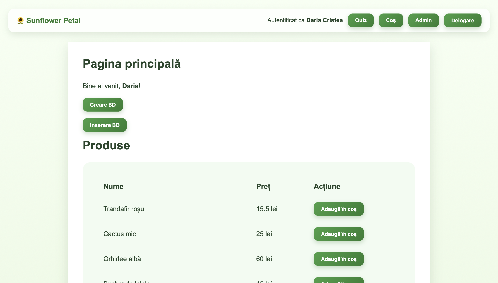
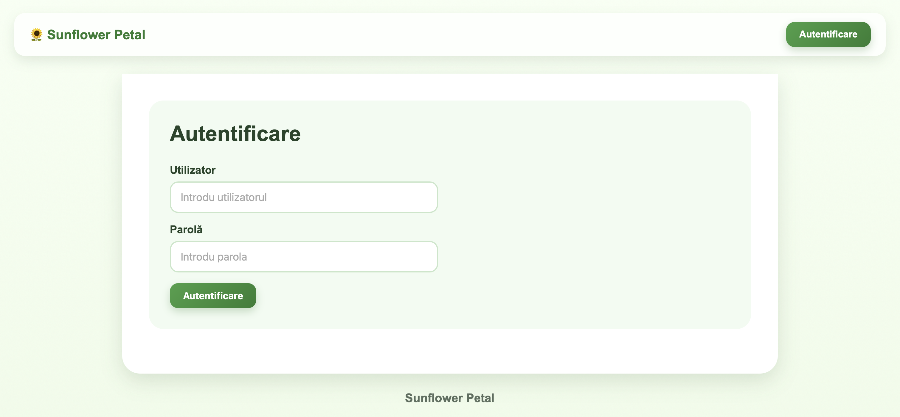
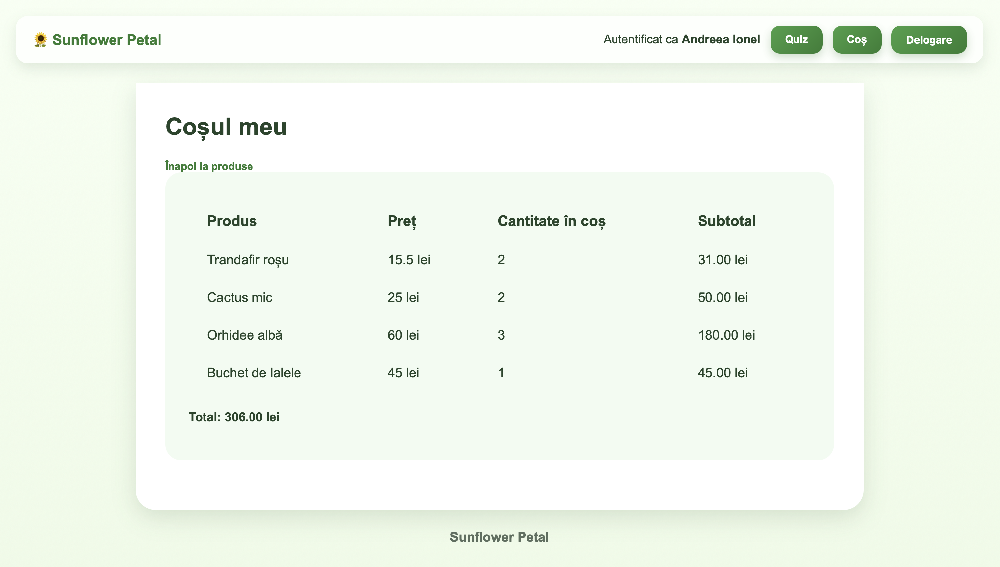
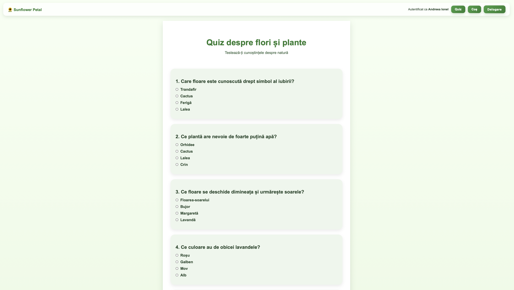
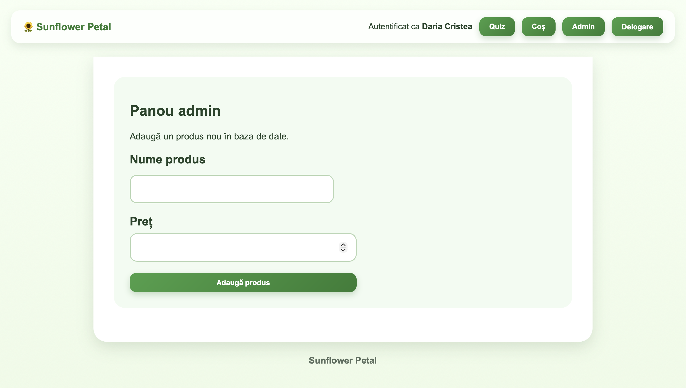

# 🌻 Sunflower Petal

<p align="center">
  
</p>

<p align="center">
  A responsive flower-shop web application built with Node.js, Express, EJS and SQLite.
  It combines a product catalog, a session-based shopping cart, role-based administration,
  a plant-themed quiz and several security-focused backend features.
</p>

<p align="center">
  
  
  
  
</p>

## Overview

**Sunflower Petal** is an educational full-stack web application for a small flower and plant shop. The project demonstrates server-side rendering, authentication, persistent data storage, session management and secure form processing in a single Express application.

Visitors can explore the available products. Authenticated users can add items to a session-based cart, view quantities and subtotals, and complete a quiz about flowers and plants. Administrators receive an additional dashboard for managing the catalog.

## Application Preview

<table>
  <tr>
    <td width="50%">
      <br>
      <strong>Session-based authentication</strong>
    </td>
    <td width="50%">
      <br>
      <strong>Shopping cart with totals</strong>
    </td>
  </tr>
  <tr>
    <td width="50%">
      <br>
      <strong>Interactive plant quiz</strong>
    </td>
    <td width="50%">
      <br>
      <strong>Role-protected admin panel</strong>
    </td>
  </tr>
</table>

## Main Features

- **Product catalog** backed by SQLite, with plant and flower products displayed in a responsive table.
- **Authentication flow** with hashed passwords and session-based login state.
- **Role-based authorization** that restricts catalog administration to users with the `ADMIN` role.
- **Shopping cart** stored in the session, including quantities, subtotals and a calculated total.
- **Interactive quiz** loaded from JSON, with multiple-choice questions and a score summary.
- **Admin dashboard** for adding products through a protected form.
- **Responsive UI** with a botanical visual theme, reusable EJS layouts and mobile-friendly styles.

## Security-Oriented Features

This project includes several backend safeguards implemented for educational purposes:

- bcrypt password hashing;
- server-side sessions with HTTP-only cookies;
- CSRF protection for the administrator product form;
- input normalization, escaping and validation;
- parameterized SQLite queries;
- temporary login throttling after repeated failed attempts;
- temporary IP blocking after repeated requests to non-existent routes;
- role checks for administrator-only routes.

> This is an educational project, not a production deployment. Before deploying publicly, move the session secret to an environment variable, use secure cookies over HTTPS and review the authentication and rate-limiting configuration.

## Tech Stack

| Category | Technology |
|---|---|
| Runtime | Node.js |
| Web framework | Express |
| View engine | EJS and `express-ejs-layouts` |
| Database | SQLite |
| Authentication | `express-session`, `bcryptjs`, `cookie-parser` |
| Validation and security | `validator`, `csurf`, parameterized SQL queries |
| Styling | HTML and CSS |

## Project Structure

```text
sunflower-petal/
├── app.js
├── package.json
├── package-lock.json
├── intrebari.json
├── utilizatori.example.json
├── public/
│   └── style.css
├── scripts/
│   └── hash-parole.js
├── views/
│   ├── admin.ejs
│   ├── autentificare.ejs
│   ├── chestionar.ejs
│   ├── index.ejs
│   ├── layout.ejs
│   ├── rezultat-chestionar.ejs
│   └── vizualizare-cos.ejs
└── screenshots/
```

## Run the Project Locally

### 1. Install the dependencies

```bash
npm install
```

### 2. Create a local user seed file

The real local user file is intentionally excluded from version control. Start from the safe example file:

```bash
cp utilizatori.example.json utilizatori.json
npm run hash-parole
```

### 3. Start the server

```bash
node app.js
```

### 4. Open the application

Visit:

```text
http://localhost:6789
```

The SQLite databases are created and used locally. They are intentionally ignored by Git.

## Suggested Demo Flow

1. Open the home page and inspect the product catalog.
2. Sign in with a local demo account.
3. Add several products to the shopping cart and review the calculated total.
4. Complete the flower and plant quiz.
5. Sign in with a local administrator account and open the admin dashboard.

## Possible Future Improvements

- Move configuration values and the session secret to environment variables.
- Add product images and product categories.
- Persist shopping-cart items in the database.
- Add automated tests for routes and authorization rules.
- Add a dedicated error page and richer validation feedback.
- Deploy the application with HTTPS and a production-grade session store.

## Author

**Daria Cristea**  
GitHub: `@DariaAdelinne`
